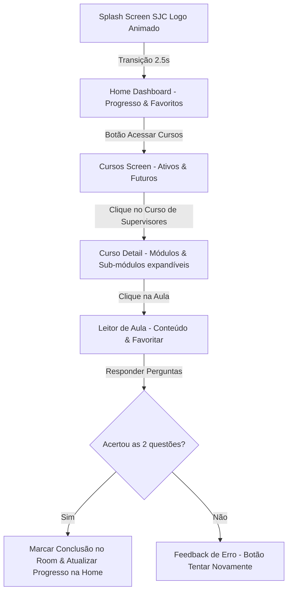

# 🎓 Universidade do Servidor

Plataforma offline de capacitação continuada e desenvolvimento profissional para os servidores da Prefeitura Municipal de São José dos Campos.

---

## 🛠️ Stack Tecnológica


---

## 🎨 Identidade Visual e Identidade Municipal

O aplicativo foi projetado com uma estética premium e totalmente integrada às cores e símbolos oficiais de **São José dos Campos**:
* **Paleta de Cores:** Combinação harmoniosa de Azul Oficial (`#003882`) e Ouro/Dourado (`#FFD700`), alinhada à bandeira municipal.
* **Splash Screen Animada:** O logotipo do aplicativo une o capelo universitário com a palavra `UNIVERSIDADE DO SERVID[O]R`, onde a letra **O** é substituída pelo desenho vetorial da **engrenagem da bandeira de SJC** que rotaciona em 360° de forma contínua usando Canvas nativo do Compose.

---

## 🌟 Funcionalidades (Fase 1 - MVP)

* **Dashboard de Progresso (Home):** Exibição em tempo real do progresso de leitura do usuário (aulas lidas, porcentagem de conclusão e barra de progresso gráfica) e atalho rápido para as aulas marcadas como favoritas.
* **Catálogo de Cursos:** Tela que gerencia os cursos da plataforma. O **Curso de Supervisores** está ativo para acesso completo, enquanto cursos futuros (Excel, Planejamento Estratégico, etc.) aparecem bloqueados em itálico e com opacidade reduzida.
* **Menus Aninhados:** Detalhes do curso estruturados com módulos expandíveis que revelam suas respectivas aulas. Módulos com aula única direta abrem o conteúdo imediatamente ao clique, sem necessidade de expansão.
* **Favoritos offline:** Opção de favoritar aulas para acesso rápido na Home, persistida em banco de dados local.
* **Quiz de Fixação:** Ao final de cada aula, o servidor deve responder a um quiz interativo com duas perguntas de múltipla escolha. O acerto total valida a aula como concluída, salvando o progresso de forma instantânea.

---

## 🔄 Fluxo de Navegação do Aplicativo

O diagrama abaixo ilustra o comportamento do usuário e o fluxo de transições de telas dentro do app:



---

## 📐 Arquitetura

O projeto foi construído sobre as diretrizes da **Clean Architecture** aliada ao padrão **MVVM (Model-View-ViewModel)**:

```txt
┌─────────────────────────────────────────────────────────────┐
│                       UI Layer (Compose)                    │
│           (Telas, Componentes Canvas, Temas de Cores)       │
└──────────────────────────────┬──────────────────────────────┘
                               │ Observa StateFlow / Envia Eventos
┌──────────────────────────────▼──────────────────────────────┐
│                    ViewModel Layer (Hilt)                   │
│         (Armazena estado da tela, gerencia o fluxo)         │
└──────────────────────────────┬──────────────────────────────┘
                               │ Dispara Ações
┌──────────────────────────────▼──────────────────────────────┐
│                     Domain Layer (UseCases)                 │
│         (Modelos puros Kotlin, Regras de negócio)           │
└──────────────────────────────┬──────────────────────────────┘
                               │ Acessa Contratos (Interfaces)
┌──────────────────────────────▼──────────────────────────────┐
│                      Data Layer (Room)                      │
│        (Mappers, Repositório e banco offline Room)          │
└─────────────────────────────────────────────────────────────┘
```

---

## 🚀 Como Executar o Projeto

1. Certifique-se de que o **Android Studio** esteja atualizado (compatível com Kotlin 2.2.x).
2. Clone este repositório e abra o projeto.
3. Aguarde a sincronização do Gradle (que irá baixar as dependências catalogadas em `libs.versions.toml`).
4. Execute o aplicativo em um Emulador ou dispositivo físico conectado rodando Android 8.0 (API 28) ou superior.

---

## 📸 Screenshots (Demonstração)

*Adicione aqui as capturas de tela do app rodando no seu dispositivo para enriquecer a vitrine:*

| Splash Screen | Home Dashboard | Catálogo de Cursos | Detalhe do Curso |
| :---: | :---: | :---: | :---: |
| *[Adicionar Print]* | *[Adicionar Print]* | *[Adicionar Print]* | *[Adicionar Print]* |

| Leitor de Aula | Quiz Interativo | Feedback de Sucesso |
| :---: | :---: | :---: |
| *[Adicionar Print]* | *[Adicionar Print]* | *[Adicionar Print]* |
