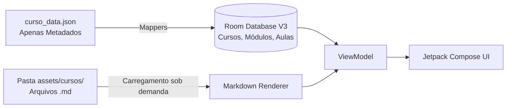
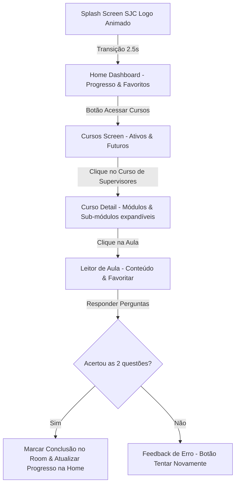

# 🎓 Universidade do Servidor

<div align="center">
  
  <br><br>
  
</div>

<br>

Plataforma offline de capacitação continuada e desenvolvimento profissional para os servidores da Prefeitura Municipal de São José dos Campos. Atualizado para a **Versão 2** com arquitetura multi-cursos e renderização de aulas em Markdown.

---

## 🛠️ Stack Tecnológica


---

## 🎨 Identidade Visual e Identidade Municipal

O aplicativo foi projetado com uma estética premium e totalmente integrada às cores e símbolos oficiais de **São José dos Campos**:
* **Paleta de Cores:** Combinação harmoniosa de Azul Oficial (`#003882`) e Ouro/Dourado (`#FFD700`), alinhada à bandeira municipal.
* **Splash Screen Animada:** O logotipo do aplicativo une o capelo universitário com a palavra `UNIVERSIDADE DO SERVID[O]R`, onde a letra **O** é substituída pelo desenho vetorial da **engrenagem da bandeira de SJC** que rotaciona em 360° de forma contínua usando Canvas nativo do Compose.

---

## 🌟 Funcionalidades (V2 - Arquitetura Escalável)

* **Suporte Multi-Cursos Dinâmico:** Banco de dados refatorado (Room V3) que carrega dinamicamente múltiplos cursos, módulos e aulas de forma escalável.
* **Conteúdo Rico em Markdown:** Aulas formatadas com arquivos `.md` permitindo uma leitura muito mais agradável, com renderização nativa de títulos, listas e negritos no Jetpack Compose.
* **Dashboard de Progresso (Home):** Exibição em tempo real do progresso de leitura do usuário (aulas lidas, porcentagem de conclusão e barra de progresso gráfica) e atalho rápido para as aulas marcadas como favoritas.
* **Catálogo de Cursos:** Tela que gerencia os cursos da plataforma. Cursos indisponíveis aparecem bloqueados visualmente, preparando terreno para gestão via painel do administrador.
* **Menus Aninhados:** Detalhes do curso estruturados com módulos expandíveis que revelam suas respectivas aulas.
* **Quiz de Fixação:** Ao final de cada aula, o servidor deve responder a um quiz interativo. O acerto total valida a aula como concluída, salvando o progresso offline.
* **Bases para o Futuro:** Estruturas criadas para busca global em texto (SearchScreen) e sistema de avaliação de módulos por escala Likert.

---

## 🗄️ Fluxo de Dados e Conteúdo

A Versão 2 introduziu uma separação inteligente de dados para otimizar o banco local:



---

## 🔄 Fluxo de Navegação do Aplicativo

O diagrama abaixo ilustra o comportamento do usuário e o fluxo de transições de telas dentro do app:



---

## 📐 Arquitetura e Modularização

O projeto foi construído sobre as diretrizes da **Clean Architecture** aliada ao padrão **MVVM (Model-View-ViewModel)** e com os primeiros passos para uma **modularização por features** (Core, UI, Data, Domain):

```txt
┌─────────────────────────────────────────────────────────────┐
│                       UI Layer (Compose)                    │
│    (Telas modulares, Core Design System, Markdown UI)       │
└──────────────────────────────┬──────────────────────────────┘
                               │ Observa StateFlow / Envia Eventos
┌──────────────────────────────▼──────────────────────────────┐
│                    ViewModel Layer (Hilt)                   │
│         (Armazena estado da tela, gerencia o fluxo)         │
└──────────────────────────────┬──────────────────────────────┘
                               │ Dispara Ações
┌──────────────────────────────▼──────────────────────────────┐
│                     Domain Layer (UseCases)                 │
│    (Modelos puros Kotlin, Regras de progresso e prova)      │
└──────────────────────────────┬──────────────────────────────┘
                               │ Acessa Contratos (Interfaces)
┌──────────────────────────────▼──────────────────────────────┐
│                      Data Layer (Room)                      │
│ (Repositório unificado, leitura de Assets e banco Room V3)  │
└─────────────────────────────────────────────────────────────┘
```

---

## 🚀 Como Executar o Projeto

1. Certifique-se de que o **Android Studio** esteja atualizado (compatível com Kotlin 2.2.x).
2. Clone este repositório e abra o projeto.
3. Aguarde a sincronização do Gradle (que irá baixar as dependências catalogadas em `libs.versions.toml`).
4. Execute o aplicativo em um Emulador ou dispositivo físico conectado rodando Android 8.0 (API 28) ou superior.

---
